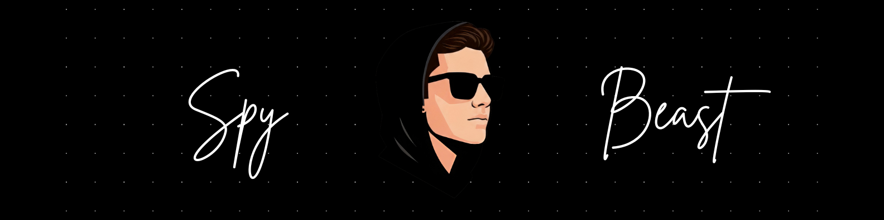

<h1 align="center">Hey, I am Kushagra!!</h1>

  

## <picture></picture> About me

- :school: I am a `Computer Science Undergraduate` at [JK Lakshmipat University](https://jklu.edu.in/)
	- Former Visiting Student at `IIIT Hyderabad` for 7th semester with 7.3 CGPA.
	- Former Visiting Student at `IIT Gandhinagar` for 3rd semester.

- :technologist: I love using Software as a solution for every `Problem`.
- :student: In AI & ML field.
- :nerd_face: Always `learning new things` and excited to grow.
- :computer: I do competitive programming sometimes at [`Codechef`](https://www.codechef.com/users/jk21024), [`Leetcode`](https://leetcode.com/u/kushagra7503/).
- :thinking: Want to know more, here is [MY RESUME](./src/Kushagra_Gupta_Resume.pdf).
<!-- - :globe_with_meridians: My personal website is [`HERE`](https://kushagra7503.github.io/Portfolio/). -->

## Connect with me on

&nbsp;

## 🛠️ Skills

**Languages**  

**Frontend**  

**Backend & APIs**  

**Data, ML & Visualization**  

**Databases, Cloud & Monitoring**  

**Tools & Platforms**  

## <picture>  </picture> My Programming Profiles

<table>
	<td align="center">
		<a href="https://leetcode.com/kushagra7503/" target="_blank" rel="noreferrer">
			
			 LeetCode
		</a>
	</td>
	<td align="center">
		<a href="https://www.codechef.com/users/jk21024" target="_blank" rel="noreferrer">
			
			 CodeChef
		</a>
	</td>
<!-- 	<td align="center">
		<a href="https://www.codingame.com/profile/ee6cf58c6b509e7edb8f1935d5a7ac049118445" target="_blank" rel="noreferrer">
			
			 CodingGame
		</a>
	</td> -->
</table>

## 📊 GitHub Stats:
 

 

## 🏆 GitHub Trophies

